# 慧通使用教程

- 访问地址：<u>https://xdechat.xidian.edu.cn/</u>

## 一、新用户登录

    慧通支持西电校内师生通过 **“西安电子科技大学统一身份认证”** 进行登录。

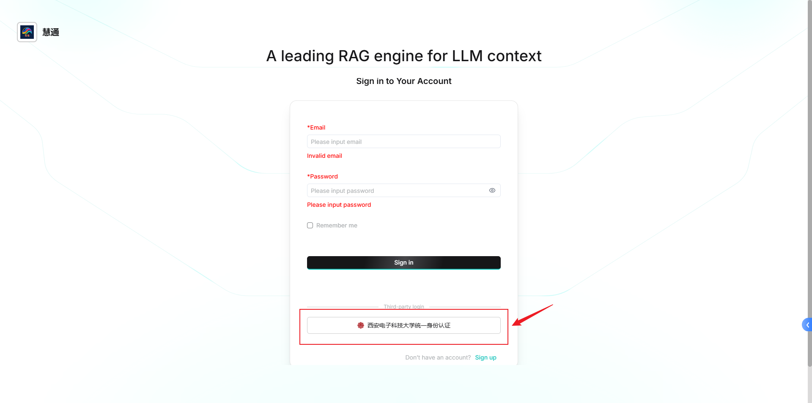

图1 慧通登录界面

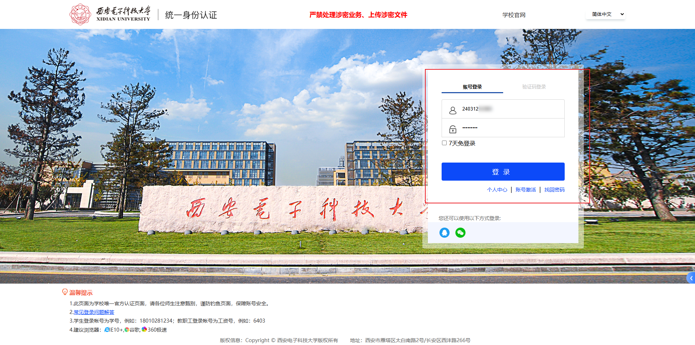

图2 西安电子科技大学统一身份认证

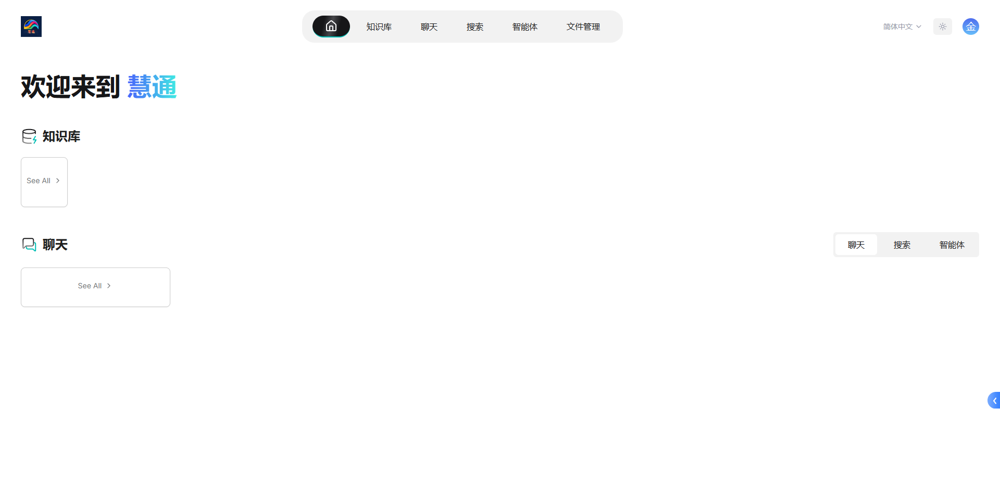

图3 慧通主界面

 

## 二、通用设置

    用户可以在点击右上角头像进入设置界面更新以下内容：个人信息、团队信息、模型配置、MCP服务。

### 1．个人信息

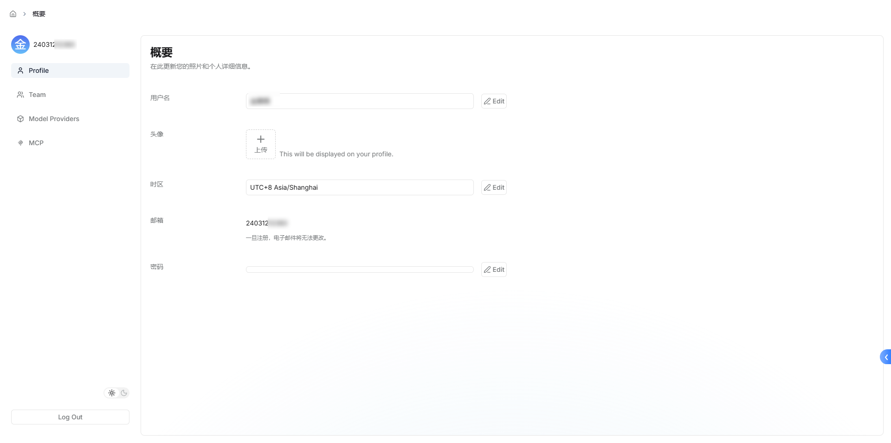

图4 个人信息界面

### 2．团队信息

    师生用户默认添加到 **“慧通管理团队”**。

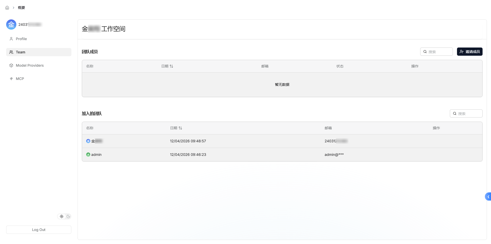

图5 团队信息界面

### 3．模型配置

    慧通所有的服务，都基于大模型进行展开。由于西安电子科技大学超算中心的网络要求，**用户无法添加自己的模型**；仅能**共用部署在超算中心本地的模型**。用户初始默认模型配置如下（**请勿自行修改**）：

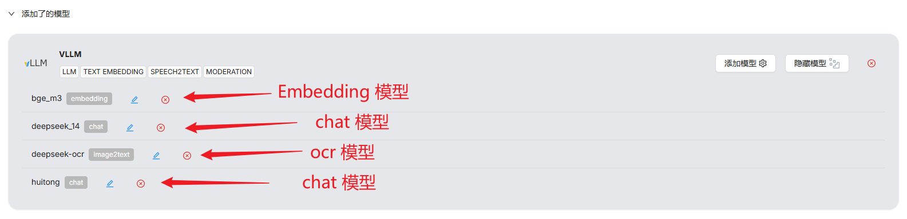

图6 模型配置

    其中，Embedding 模型默认为 bge-m3；Ocr 模型默认为 deepseek-ocr；这两个模型在知识库构建和检索时需要使用。Chat 模型为大家提供 **deepseek-14B 以及 “慧通大模型”** 供大家使用。

### 4．MCP服务

    同样受制于西安电子科技大学超算中心的网络要求，**用户无法添加远端的 MCP 服务使用**；敬请期待西电内部的 MCP 服务！

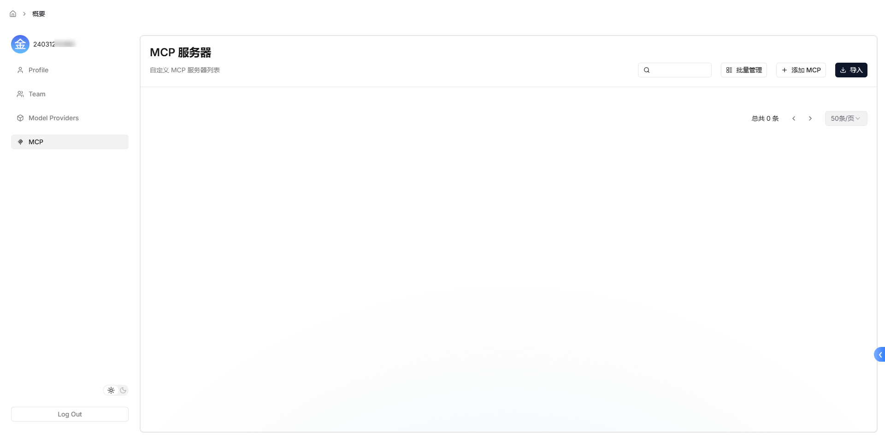

图7 MCP服务配置

 

## 三、知识库

    知识库是**用于在聊天模块和智能体模块中检索**的；会根据用户的问题进行相似度计算，返回相似度超过阈值的 Top-K 个文档。

### 1．新建知识库

    进入知识库界面，点击创建知识库。

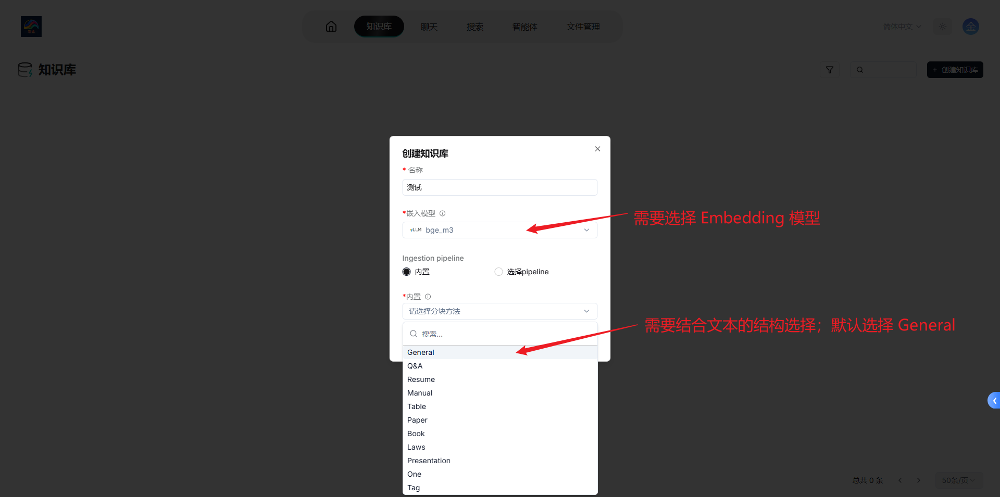

图8 新建知识库

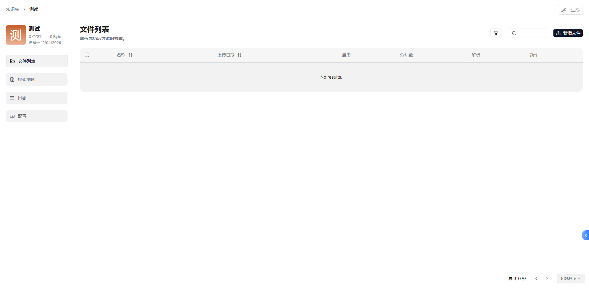

图9 知识库设置界面

### 2．新增文件

    新增文件即**将文件索引在该知识库中**，用于后续的检索使用。你可以上传待检索的文件，支持 Docx、Doc、PDF、TXT 等文件格式。

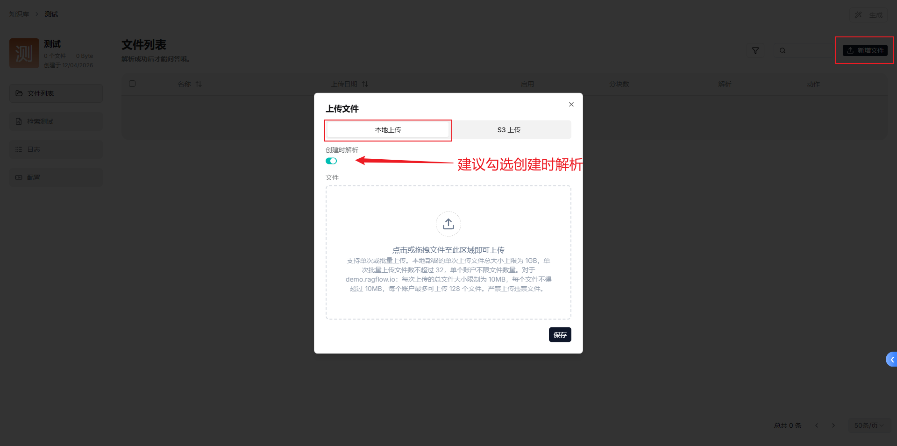

图10 新增文件

    当新增文件解析成功后，你可以查看**解析结果**或**进行单文档检索问答**。

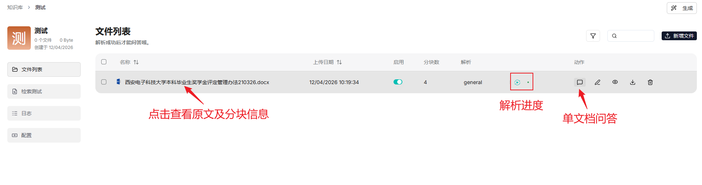

图11 文件解析成功

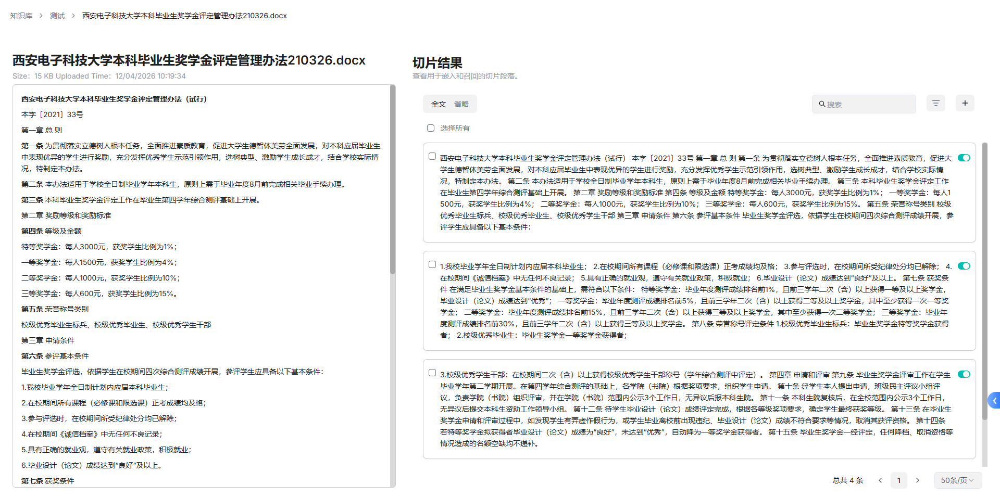

图12 原文及分块结果

    在单文档问答中，你可以询问与该文档相关的信息；也可以**根据文档中图片重要性决定采用哪种方式。**

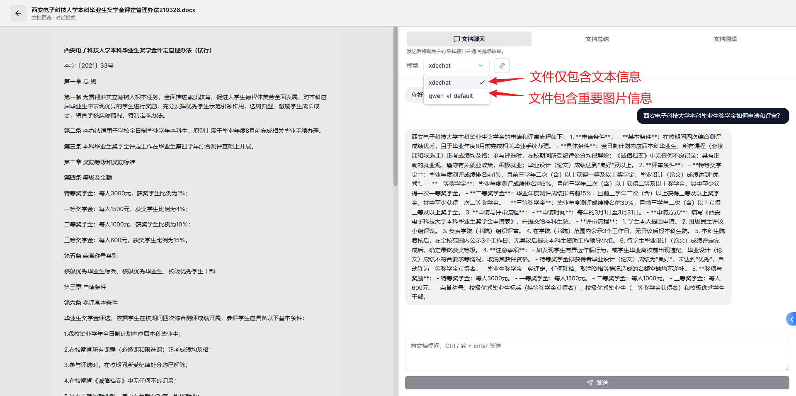

图13 单文档问答

### 3．检索测试

    你可以在检索测试模块进行相关测试，以验证分块的合理性和检索的可用性。你可以根据需要调整 **相似度阈值** 和 **向量相似度权重。**

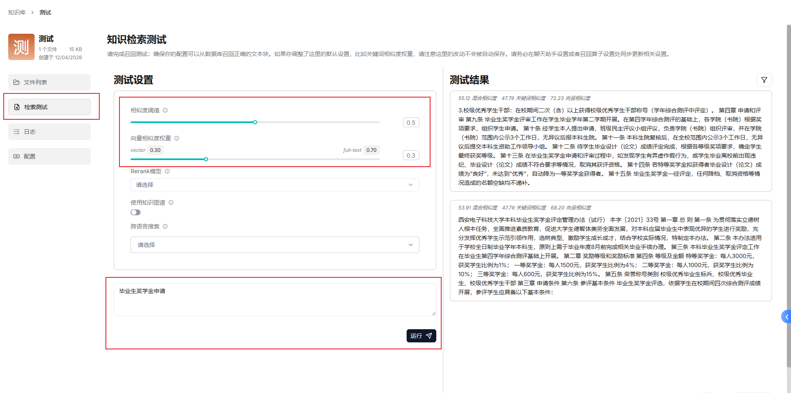

图14 检索测试

## 四、聊天模块

    你可以在聊天模块 **创建自己的聊天配置**。同时我们默认提供了 **9个聊天智能体** 供大家使用。

### 1．默认聊天智能体

    默认的聊天智能体包括：

- **西电慧教：** 为教师提供的智能体；你可以用于 教学方案设计生成 和教学试题生成。
- **西电慧学：** 为学生提供的智能体；你可以用于各学科问题问答。
- **西电慧评：** 为学生提供的智能体；你可以用于自动评审自己的毕业论文。
- **西电慧管：** 管理类问题的统一入口，包含人事咨询、制度咨询、党务百科；对于不确定的管理类问题，可以直接使用该智能体。
- **西电人事咨询、西电制度咨询、西电党务百科：** 具体的业务，当对问题划分明确时，建议直接使用这些智能体进行咨询。
- **领导致辞、报告生成：** 任务类智能体，你需要根据要求提供信息，以生成相关致辞或报告。

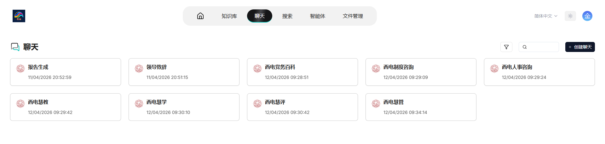

图15 默认聊天智能体

### 2．新建聊天

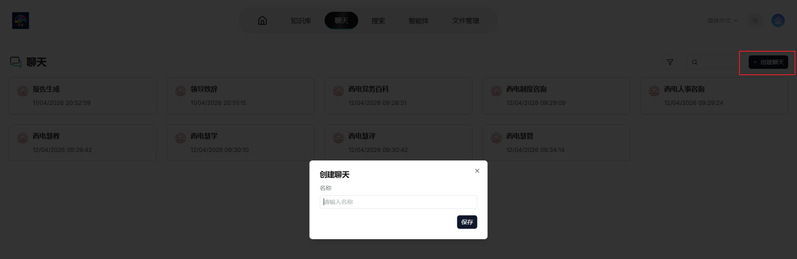

图16 新建个人聊天模块

    新建个人聊天模块后，需要对聊天进行配置。点击左下角聊天设置，进行相关配置。

    **需要关注的是：**

- 知识库：你需要设置检索使用的知识库，也可以置空。 **置空时请注意将提示词中的 {knowledge} 删除，并且在变量中删除。** 若需要检索，注意按自己的需求配置检索阈值等信息。
- 模型：模型需要选择 Chat 模型；默认提供 慧通大模型 和 Deepseek-14B 模型。
- 聊天参数：根据自己的需要设置，如不清楚建议选择自由度“平衡”；**注意最大 Token 数建议设置为 16384。**

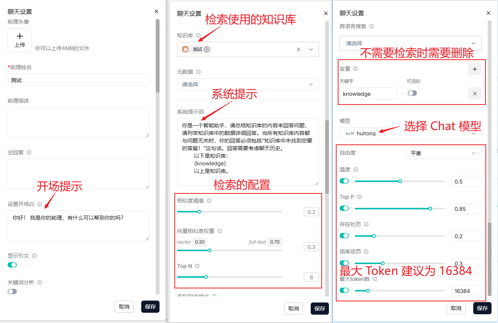

图17 个人聊天模块配置

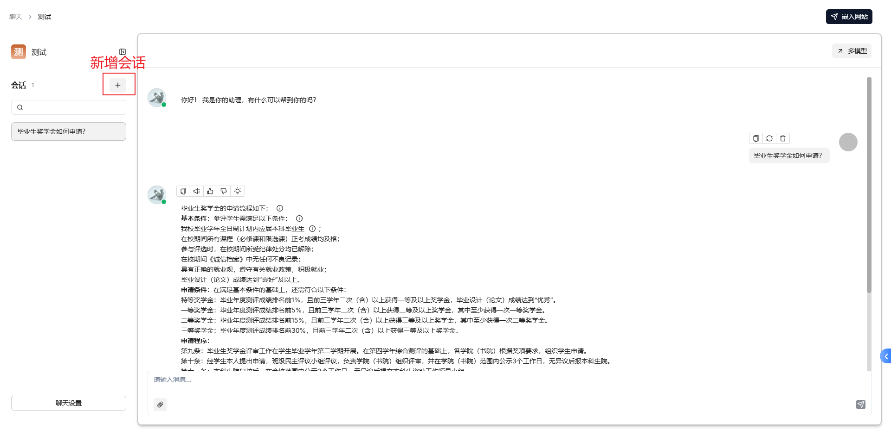

图18 新增会话

## 五、智能体

    智能体初始默认提供 **9个智能体（即聊天界面的9个）**。默认智能体无法编辑，仅能查看。你可以新增创建自己的智能体应用。

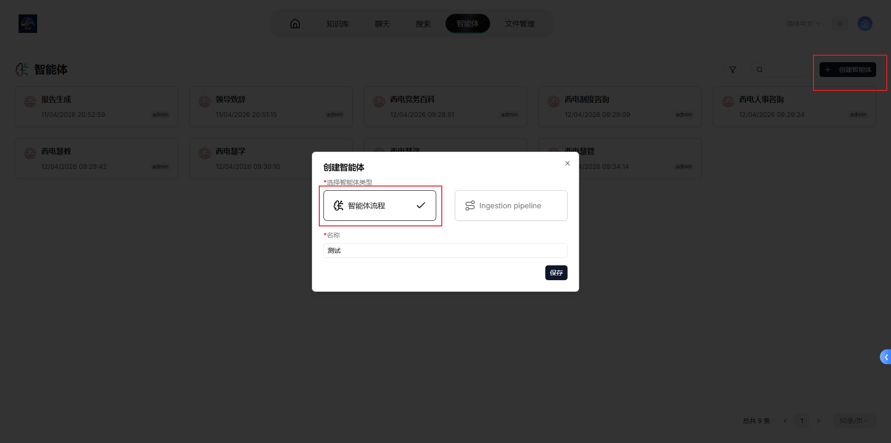

图19 新增智能体

    智能体创建是一个非常自由的画布，你可以按自己的想法去创建任何流程的智能体。**智能体最简单的工作流如下所示：输入 -> 检索 -> 大模型 -> 输出。**

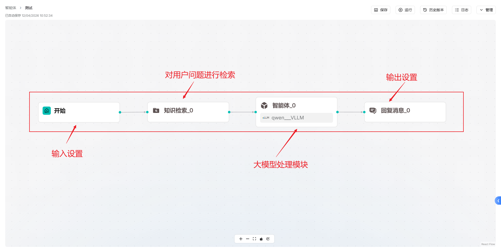

图20 智能体创建

    现在，你可以自由探索你的智能体构建！

    保存后的智能体会出现在聊天模块中直接使用。

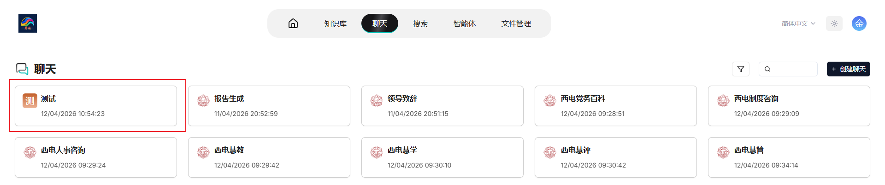

图21 智能体保存

